даї нос со́ос с віа тнàлн рно́ нồ снí міNH тви ́ до́ NG ваї нос кноа нос ти ́ нне

KHOA CONG NGHÊ THÔNG TIN

PHAN TICH VA QUAN LY YEU CAU PHAN MEM

DŲ’ÁN: HȨ THŎNG QUÀN LY TRUNG TÂM ANH NGŨ’

BÁO CÁO: MATRIX ÁNH XA LUU VÉT GIUA USECASE VÀ PROTOTYPE

Giáo viên hướng dẫn: Trưởng Phước Lộc

Hồ Tuấn Thanh

Phạm Nguyễn Sơn Tưng

Nhóm : 07

Thành viên : 22127232 – Lê Thị Ngọc Linh 22127305 – Nguyễn Thiện Nhân 22127311 – Hồ Hà Nhi 22127316 – Nguyễn Ngô Ngọc Nhu ' 22127469 – Đỗ Hải Yến

Hồ Chí Minh - 2025

---

V1.5

<table><tr><td>Ngày</td><td>Phiên bán</td><td>Mô tá</td><td>Ngurời thay đối</td></tr><tr><td>15/04/2025</td><td>1.0</td><td>Hoàn thành nội dung mục l. Giới thiệu của báo cáo</td><td>Đỗ Hải Yến</td></tr><tr><td>16/04/2025</td><td>1.1</td><td>Nội dung UseCase, Protype và bảng ma trận lưu vết của role Admin</td><td>Đỗ Hải Yến</td></tr><tr><td>16/04/2025</td><td>1.2</td><td>Nội dung UseCase, Prototype và bảng ma trận lưu vết của role Giáo viên</td><td>Nguyễn Ngô Ngọc Như</td></tr><tr><td>22/04/2025</td><td>1.3</td><td>Nội dung UseCase, Protype và bảng ma trận lưu vết của role Học viên</td><td>Hồ Hà Nh</td></tr><tr><td>27/04/2025</td><td>1.4</td><td>Nội dung UseCase, Protype và bảng ma trận lưu vết của role Quản lý trung tâm và role Khách truy cập</td><td>Lê Thị Ngọc Linh</td></tr><tr><td>28/04/2025</td><td>1.5</td><td>Sửa format báo cáo</td><td>Hồ Hà Nh</td></tr></table>

Bàng ghi nhận thay dổi tài liệu

HE THONG QUAN LY TRUNG TAM ANH NG

---

V1.5

TABLE OF CONTENTS

HE THONG QUAN LY TRUNG TAM ANH NGU

---

V1.5

### I. Giới thiệu

Trong báo cáo này, nhóm sê trình bày Matrix ánh xạ lưu vết giữa danh sách Use Case và danh sách các Prototype đã thiết kế. Mục đích của Matrix này là đám báo rằng tất cả các yêu cầu hệ thống (Use Case) đều được phản ánh và triển khai trong thiết kế Prototype. Matrix ánh xạ giúp theo đõi sự liên kết giữa các yêu cầu và thiết kế, đám báo rằng hệ thống được xây dựng chính xác và đáp úrng yêu cầu của người đùng.

## II. Danh sách Use Case và Prototype

### 1. Use Case

Các Use Case là các yêu cầu hoặc các tình huống mà người dùng hoặc hệ thống có thế gập phái. Dười đây là danh sách các Use Case của hệ thống:

- a) Quán lý trung tâm
- 1. Trang chú
- 2. Quán lý danh sách hồ sơ giáo viên
- 3. Quán lý danh sách hồ sơ quản trị viên
- 4. Tạo mới và điều chỉnh thông tin giáo viên
- 5. Tạo mới và diều chỉnh thông tin admin
- 6. Theo dōi lịch sử hoạt động
- b) Admin
- 1. Tạo mới và diều chỉnh thông tin học viên
- 2. Theo dõi diểm cuối khóa của học viên ở các khóa học đã và dang tham gia
- 3. Cập nhật trạng thái học tập của học viên
- 4. Điều chình và tạo mới thông tin khóa học
- 5. Phân công giáo viên giàng dạy cho từng khóa
- 6. Thêm, xóa học viên trong từng khóa học
- 7. Nhan ban khóa học
- 8. Tài/Xóa tài liệu học tập
- 9. Phan loahi tai lięu theo buói học của khóa học
- 10. Al hõ trợ phân loại tài liệu theo buổi học của khóa học cụ thể
- 11. Nhán tin trực tiếp với giáo viên, admin khác trên hệ thống
- 12. Xem lịch sử tin nhẩn
HE THONG QUAN LY TRUNG TAM ANH NG

---

V1.5

- c) Giáo viên
1. Xem danh sách khóa phụ trách và lọc theo trạng thái

2. Xem thong tin chi tiết của từng khóa học

3. Tim kiếm, lọc danh sách học viên phụ trách và xuất tập tina

4. Cập nhật hồ sơ cá nhân (ánh đại diện, số diện thoại, email, địa chỉ, mật khấu)

5. Xem và cập nhật diếm thường xuyên, giữa khóa và cuối khóa

6. Trò chuyện qua hệ thống tin nhắn với học viên

7. Xem lịch sử tin nhấn với học viên

- d) Hoc viên
1. Xem danh sách khóa hoc

2. Theo dōi tiến trinh học tập theo từng khóa học

3. Truy cập tài liệu học tập trong từng khóa

4. Quan ly h o sa cán han

5. Nhan tin trực tiếp với giáo viên

6. Xem lịch sử tin nhản

7. Dieu chinh trang thái học tập

- e) Khách truy cập
- 1. Xem thōng tin vē trung tâm
2. Xem lịch khai giảng khoá học

3. Dàng nhập vào hẹ̃ thống

2. Prototype

- Các Prototype là các bản thiết kế giao diện của hệ thống. Duối đây là danh sách các Prototype dã thiết kế:

a) Quan ly trung tâm

1. Prototype 1: Màn hình thị trang chủ của trung tâm

HE THONG QUAN LY TRUNG TAM ANH NG

---

V1.5

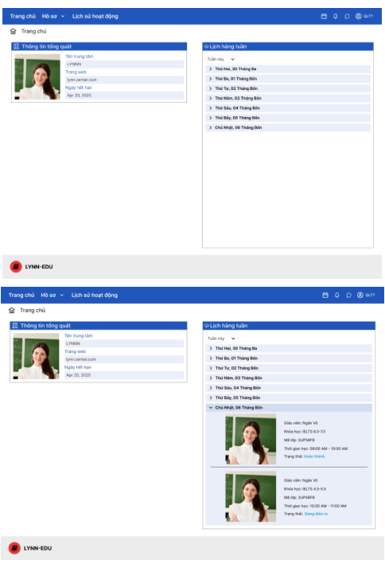

HE THONG QUAN LY TRUNG TAM ANH NGU

---

V1.5

## 2. Prototype 2: Màn hình danh sách hồ sơ giáo viên

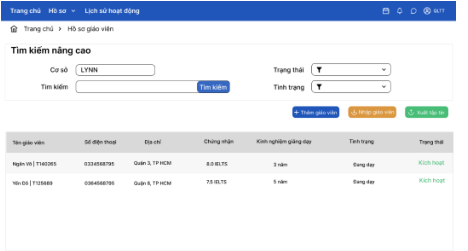

### ● LYNN-EDU

3. Prototype 3: Màn hình xuất danh sách hồ sơ giáo viên

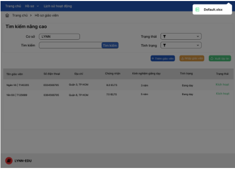

HE THONG QUAN LY TRUNG TAM ANH NG

---

V1.5

## 4. Prototype 4: Màn hình danh sách hồ sơ quản trị viên

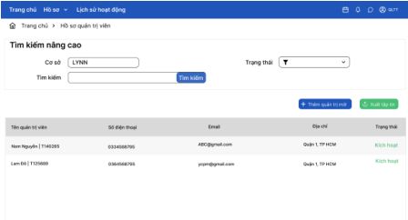

## 西瓜视频

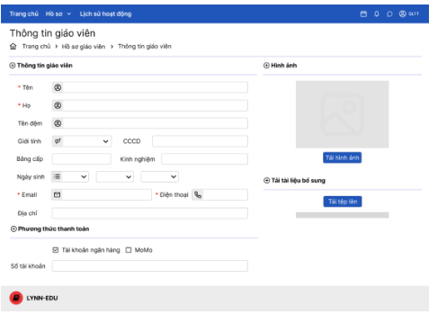

HE THONG QUAN LY TRUNG TAM ANH NG

---

V1.5

## 6. Prototype 6: Màn hình xem và chình sửa thông tin giáo viên

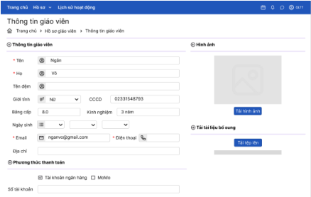

### LYMP-EOU

### 7. Prototype 7: Màn hình thêm thông tin Admin

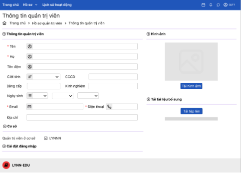

HE THONG QUAN LY TRUNG TAM ANH NGU

---

V1.5

8. Prototype 8: Màn hình xem và chình sửa thông tin Admin

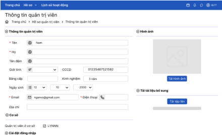

LYNW-EDU

## 9. Prototype 9: Màn hình lịch sử hoạt động

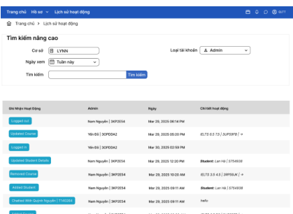

HE THONG QUAN LY TRUNG TAM ANH NG

-

---

V1.5

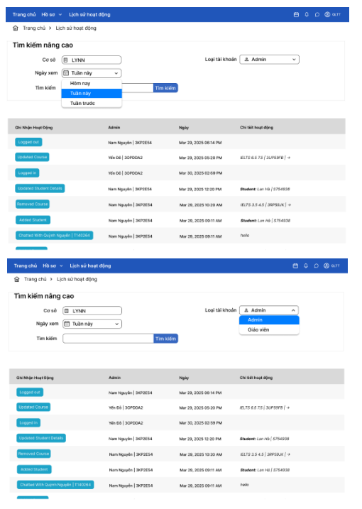

HE THONG QUAN LY TRUNG TAM ANH NG

-

---

V1.5

Tim kiém náng cao

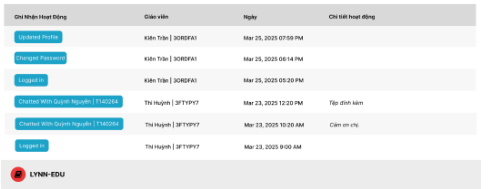

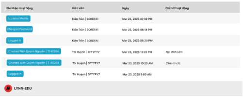

HE THONG QUAN LY TRUNG TAM ANH NG

-

---

V1.5

b) Admin

1. Prototype 1: Man hình thị hồ sơ học viên của trung tâm

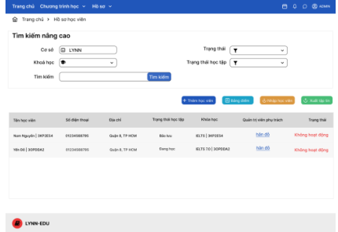

2. Prototype 2: Màn hình thêm học viên mới

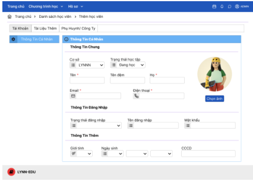

3. Prototype 3: Màn hình xem và chình sửa thông tin học viê

HE THONG QUAN LY TRUNG TAM ANH NG

-

---

V1.5

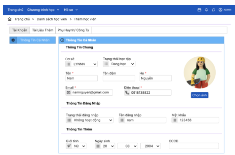

LYNW-EDU

## 4. Prototype 4: Màn hình theo dōi diểm cuối khóa của một khóa học

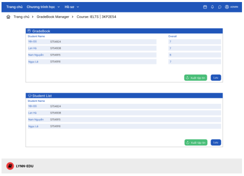

HE THONG QUAN LY TRUNG TAM ANH NGU

-

---

V1.5

## 5. Prototype 5: Màn hình danh sách các khóa học

LYMP-EDU

## 6. Prototype 6: Màn hình nhân bản khóa học

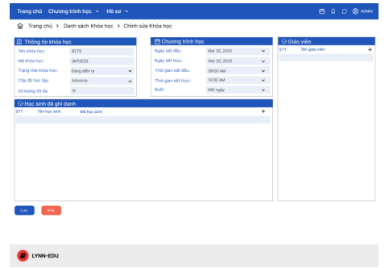

HE THONG QUAN LY TRUNG TAM ANH NG

-

---

V1.5

## 7. Prototype 7: Màn hình thêm khóa học mới

LYNN-EDU

## 8. Prototype 8: Màn hình xem chi tiết thông tin khóa học

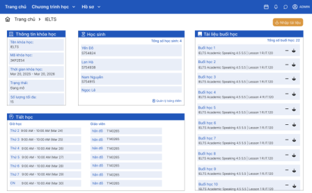

HE THONG QUAN LY TRUNG TAM ANH NG

-

---

V1.5

## 9. Prototype 9: Màn hình chình sửa thông tin một khóa học

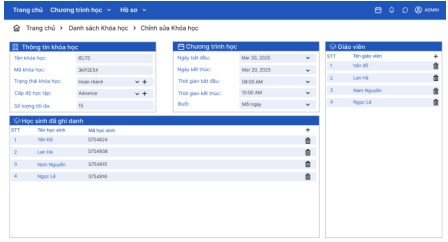

LYNN-EDU

## 10. Prototype 10: Màn hình thêm giáo viên vào khóa học

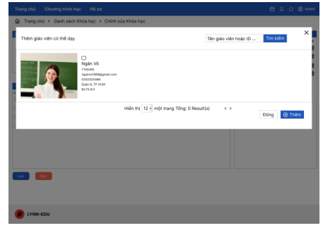

HE THONG QUAN LY TRUNG TAM ANH NG

-

---

V1.5

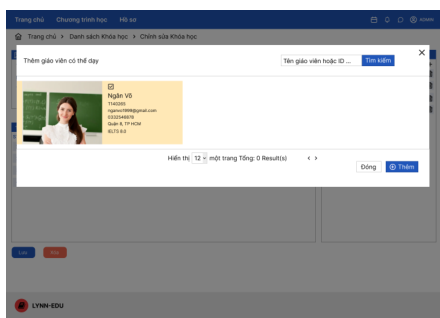

## 11. Prototype 11: Màn hình thêm học viên vào khóa học

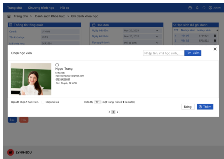

HE THONG QUAN LY TRUNG TAM ANH NGU

10

---

V1.5

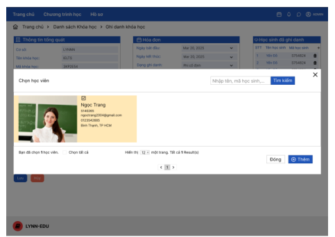

12. Prototype 12: Màn hình Al hỗ trợ phân loại tài liệu theo buổi học của khóa học cụ thể

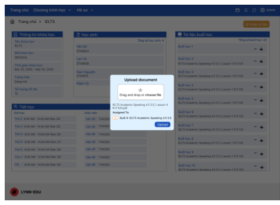

HE THONG QUAN LY TRUNG TAM ANH NG

1

---

V1.5

## 13. Prototype 13: Màn hình nhập khóa học từ file Excel

HE THONG QUAN LY TRUNG TAM ANH NG

7

---

V1.5

## 15. Prototype 15: Màn hình nhập học viên bằng file Exce

## 16. Prototype 16: Màn hình xuất danh sách học viên

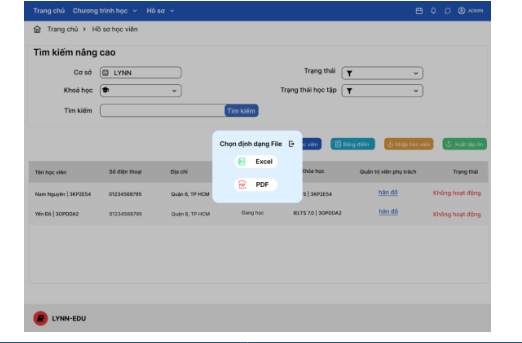

HE THONG QUAN LY TRUNG TAM ANH NGU

7

---

V1.5

## 17. Prototype 17: Man hình trang chủ

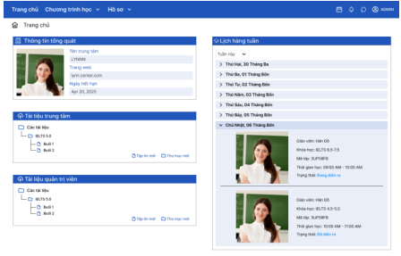

### LYNN-EDU

18. Prototype 18: Màn hình nhẩn tin trên hệ thống

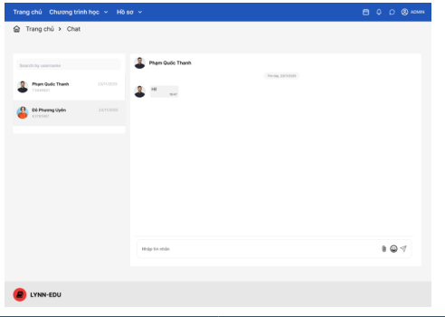

HE THONG QUAN LY TRUNG TAM ANH NGU

7

---

V1.5

## 19. Prototype 19: Màn hình thêm/xóa tài liệu buổi học

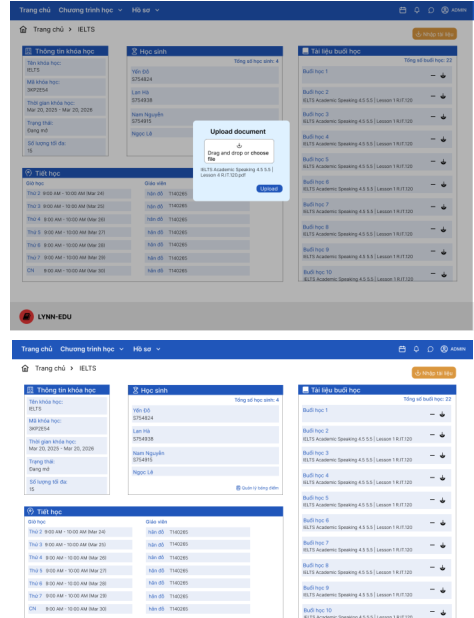

HE THONG QUAN LY TRUNG TAM ANH NG

7

---

V1.5

c) Giáo viên

## 1. Prototype 1: Dashboard

## 2. Prototype 2: Khóa học phụ trách và bộ lọc

HE THONG QUAN LY TRUNG TAM ANH NG

7

---

V1.5

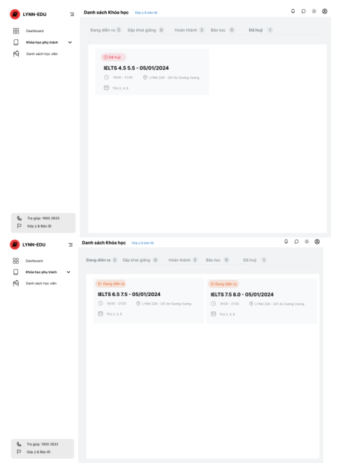

HE THONG QUAN LY TRUNG TAM ANH NGU

7

---

V1.5

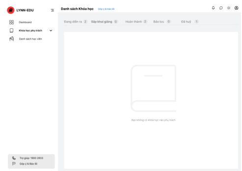

## 4. Prototype 3: Xem thong tin chung khóa học

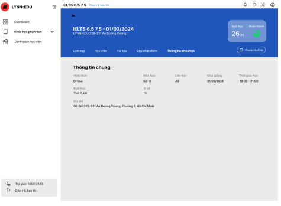

HE THONG QUAN LY TRONG IAM ANH NGO

7

---

V1.5

## 5. Prototype 4: Xem tài liệu khóa học

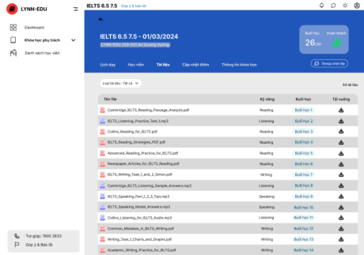

## 6. Prototype 5: Xem lịch dạy khóa học

HE THONG QUAN LY TRUNG TAM ANH NGU

7

---

V1.5

## 7. Prototype 6: Xem danh sách học viên từng khóa

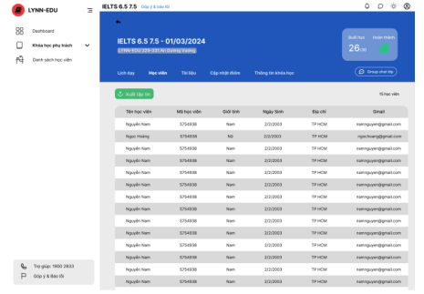

## 8. Prototype 7: Cập nhật điểm cho học viên trong khóa

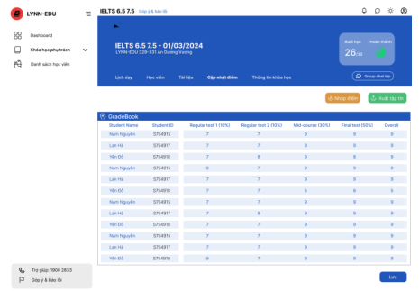

HE THONG QUAN LY TRUNG TAM ANH NG

7

---

V1.5

## 9. Prototype 8: Nhập điểm cho học viên trong khóa bằng tệp tin Excel

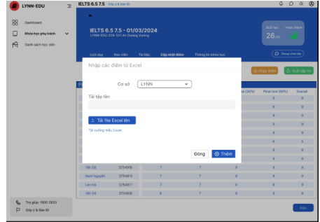

## 10. Prototype 9: Xuất tệp tin điểm học viên trong khóa

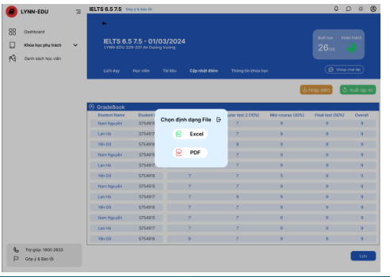

HE THONG QUAN LY TRUNG TAM ANH NG

7

---

V1.5

## 11. Prototype 10: Tim kiem danh sách học viên

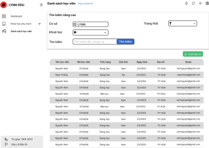

## 12. Prototype 11: Xuât tập tin học viên

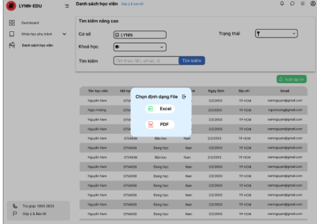

## 13. Prototype 12: Gửi/Nhận tin nhản trong hệ thốn

HE THONG QUAN LY TRUNG TAM ANH NG

3

---

V1.5

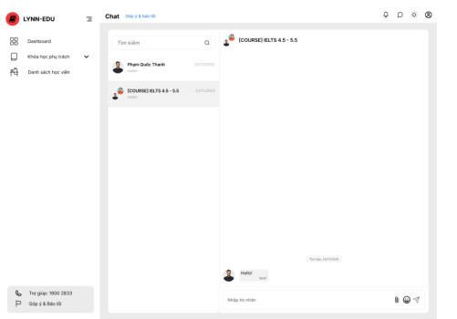

## 14. Prototype 13: Cập nhật hồ sơ

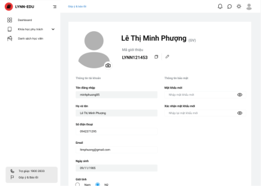

HE THONG QUAN LY TRUNG TAM ANH NGU

3

---

V1.5

d) Hoc viên

## 1. Prototype 1: Dashboard

## 2. Prototype 2: Khoá học (dang học)

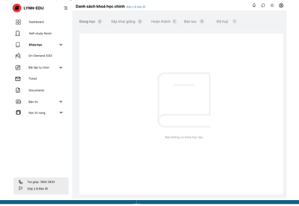

HE THONG QUAN LY TRUNG TAM ANH NGU

3

---

V1.5

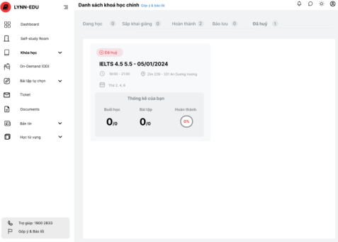

3. Prototype 3: Khoá học (dā huỷ)

## 4. Prototype 4: Khoá học (dā hoàn thành)

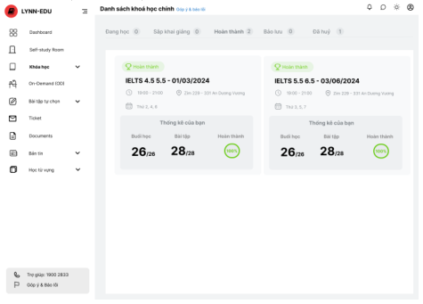

HE THONG QUAN LY TRUNG TAM ANH NGU

3

---

V1.5

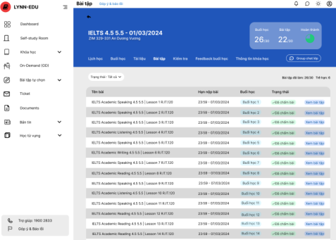

Prototype 5: Xem bài tập

## : Xem thong tin khóa học

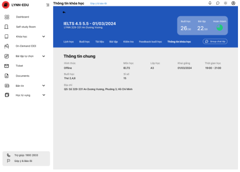

HE THONG QUAN LY TRUNG TAM ANH NG

---

V1.5

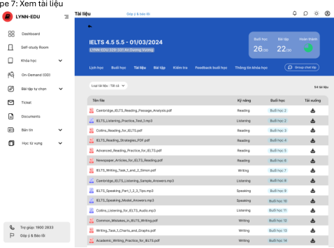

## 8. Prototype 8: Xem buoio ho

HE THONG QUAN LY TRUNG TAM ANH NG

3

---

V1.5

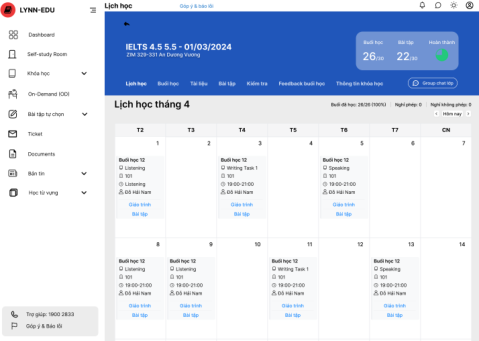

Prototype 9: Xem lịch học

## 10. Prototype 10: Kiém tra

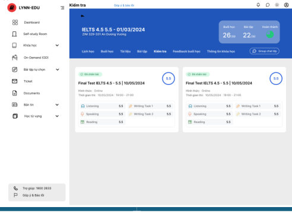

HE THONG QUAN LY TRUNG TAM ANH NG

---

V1.5

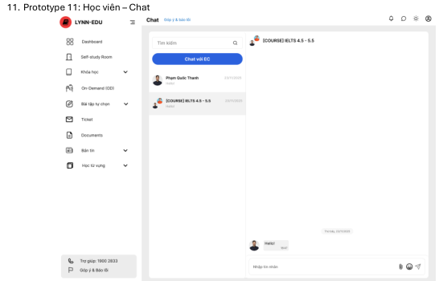

## 12. Prototype 12: G  ̈ u fi Ticke

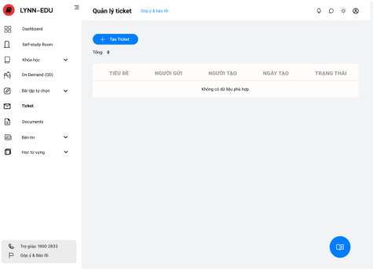

HE THONG QUAN LY TRUNG TAM ANH NGU

3

---

V1.5

13. Prototype 13: Gúi Ticket (Ticket Popup)

14. Prototype 14: Trang cán hàn

HE THONG QUAN LY TRUNG TAM ANH NG

3

---

V1.5

### e) Khách truy cập

1. Prototype 1: Màn hình xem thông tin về trung tâm

Hinh ainh thu c tế

buổi học tại LYNN-EDU

suning chia tel cualin tup los hoc véen de tula nyados si kiti quai hoc sia

HE THONG QUAN LY TRUNG TAM ANH NGU

3

---

V1.5

2. Prototype 2: Màn hình xem lịch khai giàng khoá học

HE THONG QUAN LY TRUNG TAM ANH NG

4

---

V1.5

HE THONG QUAN LY TRUNG TAM ANH NG

4

---

V1.5

3. Prototype 3: Màn hình däng nhập tài khoàn vào hệ thống

HE THONG QUAN LY TRUNG TAM ANH NGU

4

---

V1.5

## III. Báng Matrix ánh xạ lư'u vết

### 1. Quan lý trung tâm

<table><tr><td>STT</td><td>Use case</td><td>Prototype liên quan</td><td>Mô tá ánh xạ</td></tr><tr><td>1</td><td>Trang chủ</td><td>Prototype 1</td><td>Prototype này cung cấp giao diện tống quan trang chủ của một trung tâm bao gồm thông tin tống quát của trung tâm và lịch hâng tuần cho quán trị viên</td></tr><tr><td>2</td><td>Quán lý danh sách hồ sơ giáo viên</td><td>Prototype 2, 3</td><td>Prototype này cung cấp giao diện danh sách hồ sơ giáo viên giúp Quán lý trung tâm quán lý danh sách hồ sơ giáo viên của trung tâm</td></tr><tr><td>3</td><td>Quán lý danh sách hồ sơ quán trị viên</td><td>Prototype này cung cấp giao diện danh sách hồ sơ quán trị viên giúp Quán lý trung tâm quán lý danh sách hồ sơ quán trị viên của trung tâm</td></tr><tr><td>4</td><td>Tạo mới và diều chính thông tin giáo viên</td><td>Prototype 5, 6</td><td>Các Prototype này giúp Quán lý trung tâm tạo mới, chính sửa và quán lý thông tin giáo viên trong hệ thống trong hồ sơ giáo viên củng như hỗ trợ viết xuất danh sách giáo viên và nhập giáo viên bàng file Excel</td></tr><tr><td>5</td><td>Tạo mới và diều chính thông tin admin</td><td>Prototype 7, 8</td><td>Các Prototype này giúp Quán lý trung tâm tạo mới, chính sửa và quán lý thông tin admin trong hệ thống trong hồ sơ admin cũng như hỗ trợ viết xuất danh sách min và nhập giáo viên bằng file Excel</td></tr><tr><td>6</td><td>Theo dối lịch sử hoạt dộng</td><td>Prototype 9</td><td>Thực hiện qua Prototype 9, giúp Quán lý trung tâm xem lại lịch sử hoạt dộng dẫ thực hiện của giáo viên và admin.</td></tr></table>

### 2. Admin

<table><tr><td>STT</td><td>Use case</td><td>Prototype liên quan</td><td>Mô tá ánh xạ</td></tr><tr><td>1</td><td>Tạo mới và điều chính thông tin học viên</td><td>Prototype 1, 2, 3, 13, 14</td><td>Các Prototype này giúp Admin tạo mới, chính sửa và quản lý thông tin học viên trong hệ thống trong hồ sơ học viên cũng như hỗ trợ viết xuất danh sách học viên và nhập học viên bằng file Excel</td></tr><tr><td>2</td><td>Theo đổi điểm cuối khóa của học viên đ’c các khóa học đã và đang tham gia</td><td>Prototype 4</td><td>Prototype này cung cấp giao diện để Admin theo đổi kết quả học tập cuối khóa của từng học viên.</td></tr></table>

HE THONG QUAN LY TRUNG TAM ANH NGU

4

---

V1.5

<table><tr><td>3</td><td>Cêp nhật trang thái học tập của học viên</td><td>Prototype 3</td><td>Admin có thế cập nhật trang thái học tập của học viên (Đang học, Báo lưu, Hoàn thành, Đã hủy) qua Prototype này.</td></tr><tr><td>4</td><td>Điều chính và tạo mới thông tin khóa học</td><td>Prototype 5, 7, 8, 9, 15, 16</td><td>Các Prototype này giúp Admin điều chính, tạo mới và quản lý thông tin khóa học, bạo gồm tên khóa học, lịch học, giáo viên. Củng nhu’ hỗ trợ việc xuất danh sách học khóa học và nhập khóa học bằng file Excel</td></tr><tr><td>5</td><td>Phân công giáo viên giàng dạy cho từng khóa</td><td>Prototype 10</td><td>Chức năng phân công giáo viên cho các khóa học được thế hiện trang Prototype 10.</td></tr><tr><td>6</td><td>Thêm, xóa học viên trang từng khóa học</td><td>Prototype 11</td><td>Admin có thế thêm hoặc xóa học viên trang khóa học qua giao diện Prototype này.</td></tr><tr><td>7</td><td>Nhân bán khóa học</td><td>Prototype 6</td><td>Chức năng nhân bán khóa học giúp Admin tạo một khóa học mới dựa trên thông tin khóa học hiện tại mà vẫn đám bảo các tài liệu cũ vẫn được giữ nguyên.</td></tr><tr><td>8</td><td>Tâi/Xóa tài liệu học tập</td><td>Prototype 19</td><td>Admin có thế tâi lên hoặc xóa tài liệu học tập nhu’ slide, PDF, video qua Prototype này.</td></tr><tr><td>9</td><td>Phân loại tài liệu theo buối học của khóa học</td><td>Prototype 8</td><td>Prototype 8 phân loại tài liệu theo từng buối học của khóa học.</td></tr><tr><td>10</td><td>Al hỗ trợ phân loại tài liệu theo buối học của khóa học cự thế</td><td>Prototype 12</td><td>Tính năng Al phân loại tài liệu được thế hiện trang Prototype 12, giúp phân loại tài liệu tự động cho từng buối học.</td></tr><tr><td>11</td><td>Nhấn tin trực tiếp với giáo viên, admin khác trên hệ thống</td><td>Prototype 18</td><td>Giúp Admin giạo tiếp với giáo viên và các admin khác trang hệ thống qua Prototype này.</td></tr><tr><td>12</td><td>Xem lịch sử tìn nhấn</td><td>Prototype 18</td><td>Cũng được thực hiện qua Prototype 18, giúp Admin xem lại các tin nhấn đã trao đổi với các bên liện quan.</td></tr></table>

## 3. Giáo viên

<table><tr><td>STT</td><td>Use case</td><td>Prototype liên quan</td><td>Mô tá ánh xạ</td></tr><tr><td>1</td><td>Xem danh sách khóa phụ trách và lọc theo trạng thái</td><td>Prototype 1, 2</td><td>Giáo viên xem lịch dạy các khóa sắp khai giàng/dang diễn ra tại Prototype 1, xem danh sách khóa học phụ trách, phân theo trạng thái tại Prototype 2.</td></tr><tr><td>2</td><td>Xem thông tin chí tiết của từng khóa học</td><td>Prototype 3, 4, 5, 6</td><td>Giáo viên xem chi tiết một khóa học bao gồm thông tin chung (Prototype 3), tài liệu</td></tr></table>

HE THONG QUAN LY TRUNG TAM ANH NG

4

---

V1.5

<table><tr><td></td><td></td><td></td><td>(Prototype 4), lịch dạy (Prototype 5), danh sách học viên (Prototype 6).</td></tr><tr><td>3</td><td>Tìm kiếm, lọc danh sách học viên phụ trách và xuất tập tin</td><td>Prototype 10, 11</td><td>Giáo viên tra cứu và lọc học viên theo khóa học, trạng thái, tên hoặc ID (Prototype 10) và có thế xuất tập tin danh sách (Prototype 11).</td></tr><tr><td>4</td><td>Cập nhật hồ sơ cá nhân (ánh đại diện, số diện thoại, email, địa chí, mật khấu)</td><td>Prototype 13</td><td>Giáo viên xem và chính sửa thông tin tài khoán cá nhân, bao gồm mật khấu, ánh đại diện,...</td></tr><tr><td>5</td><td>Xem và cập nhật điểm thưởng xuyên, giữa khóa và cuối khóa</td><td>Prototype 7, 8, 9</td><td>Giáo viên xem và cập nhật các cột điểm cho từng học viên tưng khóa (Prototype 7), cũng như nhập điểm hàng loạt bằng Excel (Prototype 8) hoặc xuất tệp tin bằng điểm (Prototype 9).</td></tr><tr><td>6</td><td>Trò chuyện qua hệ thống tin nhấn với học viên</td><td>Prototype 12</td><td>Giáo viên trò chuyện trực tiếp với học viên hoặc nhóm lớp học, hỗ trợ trao đối tài liệu, hỏi đáp và tương tác học tập.</td></tr><tr><td>7</td><td>Xem lịch sử tin nhấn với học viên</td><td>Prototype 12</td><td>Giáo viên xem lại lịch sử các cuộc trò chuyện.</td></tr></table>

## 4. Học viên

<table><tr><td>STT</td><td>Use case</td><td>Prototype liên quan</td><td>Mô tâ ánh xạ</td></tr><tr><td>1</td><td>Xem danh sách khóa học</td><td>Prototype 1, 2, 3, 4, 6</td><td>Dashboard và các giao diện khóa học cho phép học viên theo dối trạng thái học (dang học, dã huẏ, hoàn thành), truy cập thông tin chi tiết khóa học.</td></tr><tr><td>2</td><td>Theo dối tiến trinh học tập theo từng khóa học</td><td>Prototype 8, 9, 10</td><td>Học viên có thế xem danh sách buối học, lịch học và thực hiện các bài kiếm tra để theo dối tiến độ học tập.</td></tr><tr><td>3</td><td>Truy cập tài liệu học tập trong từng khóa</td><td>Prototype 5, 7</td><td>Học viên có thế xem bài tập và tài liệu học tập tương úng với từng khóa học.</td></tr><tr><td>4</td><td>Quản lý hồ sơ cá nhân</td><td>Prototype 14</td><td>Giao diện trang cá nhân cho phép học viên xem và chỉnh sửa thông tin cá nhân.</td></tr><tr><td>5</td><td>Nhấn tin trực tiếp với giáo viên</td><td>Prototype 11</td><td>Giao diện chat hỗ trợ chức năng nhấn tin 1-1 giứa học viên và giáo viên.</td></tr><tr><td>6</td><td>Xem lịch sử tin nhấn</td><td>Prototype 11</td><td>Giao diện chat cũng cho phép xem lại lịch sử trò chuyện trước đó.</td></tr><tr><td>7</td><td>Điều chỉnh trạng thái học tập</td><td>Prototype 12, 13</td><td>Giao diện gửi ticket và popup hỗ trợ học viên gửi yêu cầu điều chỉnh trạng thái học (nhuť xin báo lưu, chuyến lớp...). Lưu ỷ: Đây là chức năng nămở giai đoạn 2 nên mới chỉ có giao</td></tr></table>

HE THONG QUAN LY TRUNG TAM ANH NG

4

---

V1.5

<table><tr><td></td><td>diện này ở phần học viên chưa bổ sung vào giao diện Admin để thực hiện chức năng.</td></tr></table>

## 5. Khách truy cập

<table><tr><td>STT</td><td>Use case</td><td>Prototype liên quan</td><td>Mô tâ ánh xạ</td></tr><tr><td>1</td><td>Xem thông tin về trung tâm</td><td>Prototype 1</td><td>Prototype này nhằm quảng bá thông tin nối bật hoặc chương trính khuyến mải, hiển thị thông tin giới thiệu về trung tâm và danh sách khoá học nổi bật, liên kết đến chì tiết khoá học. Thông tin liên hệ của trung tâm.</td></tr><tr><td>2</td><td>Xem liịch khai giảng khoá học</td><td>Prototype 2</td><td>Prototype này giúpkhách truy cập xem liịch khai giảng phủ hợp. Hiến thị thông tin ngày bắt đầu, tên khôa học, thời gian học, hình thức học.</td></tr><tr><td>3</td><td>Đằng nhậo vào hệ thống</td><td>Prototype 3</td><td>Prototype này cho phép khách truy cập có tài khoản có thế đắng nhập vào hệ thống</td></tr></table>

HE THONG QUAN LY TRUNG TAM ANH NGU

4

