**Few statistics**

13/5/2017:

Task 1

**Intro**

The chart illustrates how government in four countries invested in the transport infrastucture between 1990 and 2005.

**Overview (Trend and differences)**

Overall, **there was a decline** in the proportion of government spending on roads and transports in the UK, Portugal, Italy; meanwhile, a rise was seen in the USA. In addition, Portugal **gerenally** had the highest figures throughout the period.

- Gerenally: Khong hoan toan
- Consistently: Hoan toan

**Body 1**

The share of government’s budget spent on roads and transports in Portugal started at 27%, **after which** it saw a **progressive** decrease to **exactly** 20% in 2005 **. Conversely** , the figure for the USA rose from just over 10% in 1990 to 15% in 2005, despite a small fall in the first 5 years.

- Approximately = around = about = roughly
- Just over = north of = upward of
- Just under = shy of = downward of
- Exactly = precisely

**Body 2**

Around 22% of the Italian national budget was **went into (spend on)** transport infrastructure and a final decline from 24% in 2000 to about 19% in 2005. Similarity, **the figure for** the UK fluctuated in the range from 9% to 13% from 1990 to 2000, followed by ending the period at approximately 7%.

????

Task 1:

**Intro**

The line graph illustrates how much fishs and some other kinds of meat were consumed per person in a country in Europe from 1979 to 2004.

**Overview**

Overall, there was a decline in the amount of beef, lamb, and fish eaten, while the figure for chicken increased to surpass that of beef. Chicken was increasingly used and became the most from 1989 onwards.

**Body 1**

The amount of beef eaten per person in the country **examined** started at about 220 grams, after which it saw fluctuations until 1989, before decreasing to end the period at around 100grams. Conversely, the figure for chicken rose from just under 150 grams per person to north of 200 grams in 1989 and **kept rising to reach** 250 grams in the final year.

**Body 2**

Exactly 150 grams of lambs was used by an average person in the country mentioned in 1979, with a decline to approximately 75 gpp in 2004 **. Meanwhile** , the figure for fish decreased slightly from around 60 gpp to just under 50 gpp after a few years and maintained at this level towards the end of periods.

**Some statistics (reunite the same statistic in one group, other is reported lastly)**

- **Overview of all chart types:**
- **Dynamic Chart**
- Xu hướng, khác biệt rõ ràng ở xu hướng chung, tăng giảm đáng kể qua thời gian, ai lớn nhất ai nhỏ nhất
- **Static chart**
- Giá trị cao nhất, thấp nhất, khác biệt giữa các số liệu, số liệu có điểm chung nào
- **Map**
- Số lượng thay đổi lớn, rõ rệt nhất. Tính chất thay đổi: Vị trí quy mô, đối tượng  nào thêm vào và bỏ đi, cải tiến cơ sở hạ tầng có rõ nét ko
- **Process**
- Mấy bước, bắt đầu kết thúc, diễn ra ở đâu ntn
- **Hỗn hợp**
- 2 biểu đồ thì tóm lược 2 cái, nếu 3 trở lên thì tìm điểm chung để viết

- **COMPARISON WORDS**
- Similarity, S + V
- Likewise, S + V
- In the same way, S + V
- In a similar way , S + V
- S, however, V / However, S+V/ Nevertheless, S + V
- While S1 + V1, S2 + V2
- Whereas S1 + V1, S2 + V2

= S1 + V1. Meanwhile, S2 + V2

    - Ngoài việc sử dụng các cấu trúc so sánh nhất thông thường với the most/least/fewest, người học có thể sử dụng cấu trúc by far + so sánh nhất (the most/the highest number of…) để tăng mức độ nhấn mạnh trong câu.  Paper and packaging were manufactured     - by far the most     - among three provided products.
- Người học có thể sử dụng các từ vựng như “the majority”, “the minority” để chỉ đến phần đa số hay thiểu số.

Ví dụ: The minority of Japanese workers are employed in the agricultural sector.

- be recorded to be at the top of the list

Ví dụ: The proportion of the 15-25 age group was recorded to be at the top of the list.

- be the largest producer/consumer of ...

Ví dụ: Overall, Japan was the largest consumer of New Zealand’s kiwi fruit all time.

- be + the least/most favored/preferred

Ví dụ: Traveling by train was the least favored form of transportation.

- be + the most common/popular + N.

Ví dụ: Motorcycle is the most popular means of transport.

- The figure for X + be + X's number, (almost/more than) double/triple the figure for Y, at Y's number

Ví dụ: 350 million tonnes of paper and packaging had been produced, more than double 160 million tonnes of wood pulp and almost triple 130 million tonnes of sawn wood. (dùng tính từ twofold, threefold,double, triple, quadrupble,.., nếu double 160 millions thì là tăng gấp đôi 160 -&gt; sai)

- S + V + twice/three times/ four times/…+ as + much/many/adj/adv + (N) + as + N/pronoun.

There were twice as many children playing sports in 2009 as in 2005.

Twice as many children played sports in 2009 compared to 2005.

In 2010, the total value of New Zealand’s kiwi fruit in Japan was recorded at 271,1 million dollars, which was nearly 4 times as much as that in China.

- Tương tự như cấu trúc so sánh chung khi gặp khó khăn trong vấn đề xác định được độ chênh lệch giữa hai đối tượng, ngoài việc sử dụng các trạng từ đi kèm tính từ so sánh hơn, người học cũng có thể sử dụng các cấu trúc sau để cho thấy sự đối chiếu giữa các đối tượng:

X + be + tỉ lệ/con số + higher/lower than + Y

Ví dụ: The average figure for Country C was 10% higher than that of Country B, which was recorded at around 50% most of the time.

- Trong trường hợp các con số có độ chênh lệch quá lớn và người học không thể tính ra được tỉ lệ - độ chênh lệch đấy, người học vẫn có thể sử dụng cách so sánh một cách chung hơn bằng cách sử dụng cách diễn đạt Trạng từ + Tính từ so sánh hơn, chẳng hạn: “slightly/significantly/far higher/lower than”

Ví dụ:

The average price of a house in London was 20,000 pound, which was significantly / far higher than that of England, at around 13,000 pound.

The proportion of small businesses using social media accounted for about 28%, which is slightly lower than that of medium-sized ones.

X consumes slightly more beef than Y.

- Compared to/with/ In comparison with N

Ví dụ: Compared to/ with/in comparison with (prices in) Canada and Australia, prices in the UK are high.

- As compared to/ As opposed to

Ví dụ: Females accounted for over 90% of the teaching staff at Primary school as opposed to/compared to/in comparison with only 10% male counterparts.

...X's number, followed by Y's number of Y

Ví dụ: The highest amount of annual daytime on average is recorded for New York at 2535 hours per ear, followed closely by 2473 hours of Sydney.

- Bên cạnh đó, khi muốn diễn tả các xu hướng tương đồng/đối lập nhau, thay vì liệt kê thông tin của từng đối tượng và sử dụng các liên từ “Similarly” hay “By Contrast” như phần lý thuyết bên trên, người học có thể làm cho câu văn ngắn gọn hơn bằng cách sử dụng cách diễn đạt “a (quite) similar/opposite pattern is/was repeated for/seen in”.

a (quite) similar/opposite pattern is/was repeated for/seen in…

Ví dụ: Oil consumption in the USA increased slightly to reach its peak of 10 million barrels in 2015. A similar pattern was recorded for/seen in the number of barrels consumed in China and Middle East during the same period.

- Tương tự, cách diễn đạt “while the opposite is/was true for” cũng là một cách diễn đạt hay, đặc biệt có thể sử dụng trong phần Tổng quan (Overall) để có thể chỉ ra hai xu hướng - thông tin trái ngược nhau mà vẫn đảm bảo câu văn ngắn gọn, súc tích.

...while the opposite is/was true for…

Ví dụ:  Brazil, Vietnam and Indonesia experienced an upward trends in their coffee production, while the opposite was true for Colombia.

- Khi muốn chỉ ra một đối tượng có xu hướng đối lập/tương đồng, người học cũng có thể sử dụng cấu trúc “show a similar/different pattern”.

X + that show(s/ed) a similar/different pattern + be…

Ví dụ: The one country that showed a different pattern was Colombia.

- Khi muốn diễn tả hai đối tượng có số liệu tương đương nhau, người học cũng có thể sử dụng cách diễn đạt “share the same percentage/number of…”

X and Y share the same percentage/number of…

Ví dụ: Vietnam and China share the same percentage with 14 percent each.

- **WAY TO WRITE A LINE CHART:**

Detail 1: Nói từ điểm đầu tới điểm giao

Detail 2: Giao tới cuối

Tăng: increase, rise, grow, climb, soar, go up

Giảm: decrease, decline, fall, drop, go down, plumbe, crash

Ổn định: Remain stable, stabilize

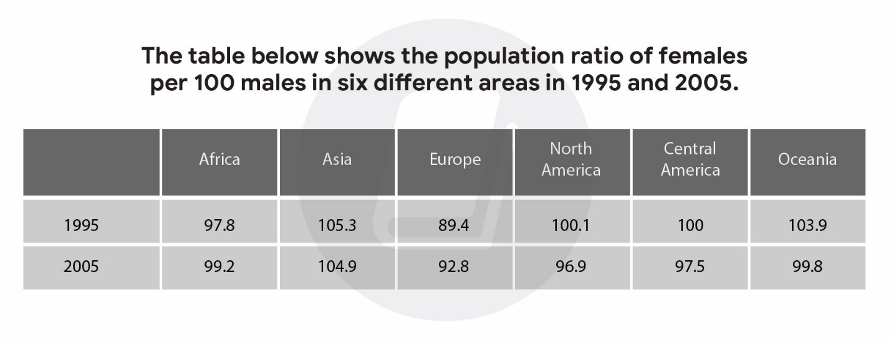

**SỬ DỤNG DANH TỪ VỚI THỂ ĐỘNG, CHỦ ĐỘNG**

Witness = see (increase, rise, growth, climb, a decrease, a decline, a  fall, a drop)

- Tăng tới: to (increase to, rise to, …)
- Tăng khoảng: of(increase of, rise of, …)

- The amount of electricity produced witnessed a rise to 6800 in 2010.
- (Lượng điện được sản xuất ra chứng kiến một sự tăng đến 6800 vào năm 2010)
- The amount of electricity produced saw an increase of 1800 from 2000 to 2010.
- (Lượng điện được sản xuất ra thấy một sự tăng khoảng 1800 từ năm 2000 đến 2010)

**(Đại lượng A) + witness/ see + danh từ sự tăng/ giảm + giới từ + (số liệu) + in (năm)**

**Danh từ sự tăng/ giảm + to + (số liệu) + in (năm) + be seen + in + (Đại lượng A)**

**Danh từ sự tăng/ giảm + of + (số liệu) + be witnessed + in + (Đại lượng A) from (năm 1) to (năm 2)**

- A decrease to 300 kg in 2008 was seen in the amount of coffee consumed.(Một sự giảm tới 300kg vào năm 2008 được thấy trong lượng cà phê được tiêu thụ.

**DÙNG GIỚI TỪ GẤP, CHẠM ĐỈNH  ĐÁY**

Các động từ: double (gấp đôi), triple (tăng gấp ba), halve (giảm phân nữa)

**(Đại lượng A) + động từ tăng/ giảm + from (năm 1) to (năm 2)**

**(Đại lượng A) + chạm đỉnh/ chạm đáy + at (số liệu) in (năm)**

Car sales increase twofold from 2009 to 2019

Car sales witnessed a twofold increase from 2009 to 2019 ( number+fold: ko dùng cho giảm xuống )

Hit a lowest point

Reach a high peak

**AFTER THAT,/ NEXT,**

Ý nghĩa truyền đạt: (Đại lượng A) + (xu hướng 1). Sau đó, (Đại lượng A) + (xu hướng 2)

Cấu trúc: (Đại lượng A) + (xu hướng 1). After that,/ Next, (xu hướng 2: mệnh đề chủ ngữ + động từ)

Sau After that,/Next, là một mệnh đề có chủ ngữ và động từ. Tùy vào thông tin thời gian được cho trong bài, người viết chia thì phù hợp động từ này (quá khứ, hiện tại, hoặc tương lai)

Thông tin số liệu: Tỷ lệ chi tiêu lên quần áo tăng đến $30000 vào năm 1960.

Tỷ lệ chi tiêu lên quần áo sau đó giữ nguyên cho đến năm 1980.

- The proportion of spending on clothing grew to $30000 in 1960.After that, this figure remained unchanged until 1980.
- (Tỷ lệ chi tiêu lên quần áo tăng đến $30000 vào năm 1960. Sau đó, con số này giữ nguyên cho đến năm 1980.)

Trường hợp tương lai: Trong tương lai, tỷ lệ chi tiêu quần áo giảm đến $10000 vào năm 2045.

Khi chuyển qua giai đoạn tương lai, người viết có thể thay “After that,/ Next, bằng In the future,

- In the future, this figure will drop to $10000 in 2045. (Trong tương lai, số liệu này sẽ giảm xuống tới $10000 vào năm 2045.

#### AFTER WHICH

#### Ý nghĩa truyền đạt: (Đại lượng A) + (xu hướng 1), sau điều này (Đại lượng A) + (xu hướng 2)

Thông tin số liệu: Tỷ lệ hộ gia đình có hai xe hơi giảm tới 70% vào năm 1997.

Tỷ lệ hộ gia đình có hai xe hơi sau đó giữ ổn định cho đến năm 2006.

- The proportion of households that had two cars dropped to 70% in 1997, after which it remained stable until 2006.
- (Tỷ lệ hộ gia đình có hai xe hơi giảm tới 70% vào năm 1997, sau điều này nó giữ ổn định cho đến năm 2006.)

#### 

#### COMPARED TO

From 2000 to 2010, there was an increase of 40 in the number of male doctors compared to a decrease of 30 in the figure for female doctors.

Ý nghĩa truyền đạt: Trong (khoảng thời gian), có một sự tăng/ giảm trong đại lượng A so với sự tăng/ giảm trong đại lượng B.

(khoảng thời gian), there + be + danh từ (sự tăng/ giảm) in đại lượng A compared to danh từ (sự tăng/ giảm) in đại lượng B.

#### While/ Whereas

Ý nghĩa truyền đạt

Trong khi đại lượng A + xu hướng A, đại lượng B + xu hướng B

Thông tin số liệu: Trong tương lai: chi tiêu lên nhà cửa tăng mạnh, chi tiêu lên quần áo giảm nhẹ.

In the future, the expenditure on housing will significantly increase while / whereas the expenditure on clothes will decrease slightly.

In contrast to the other categories

- **WAY TO WRITE PIE CHART**
- 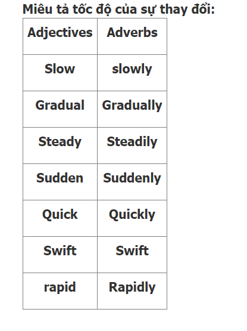
- 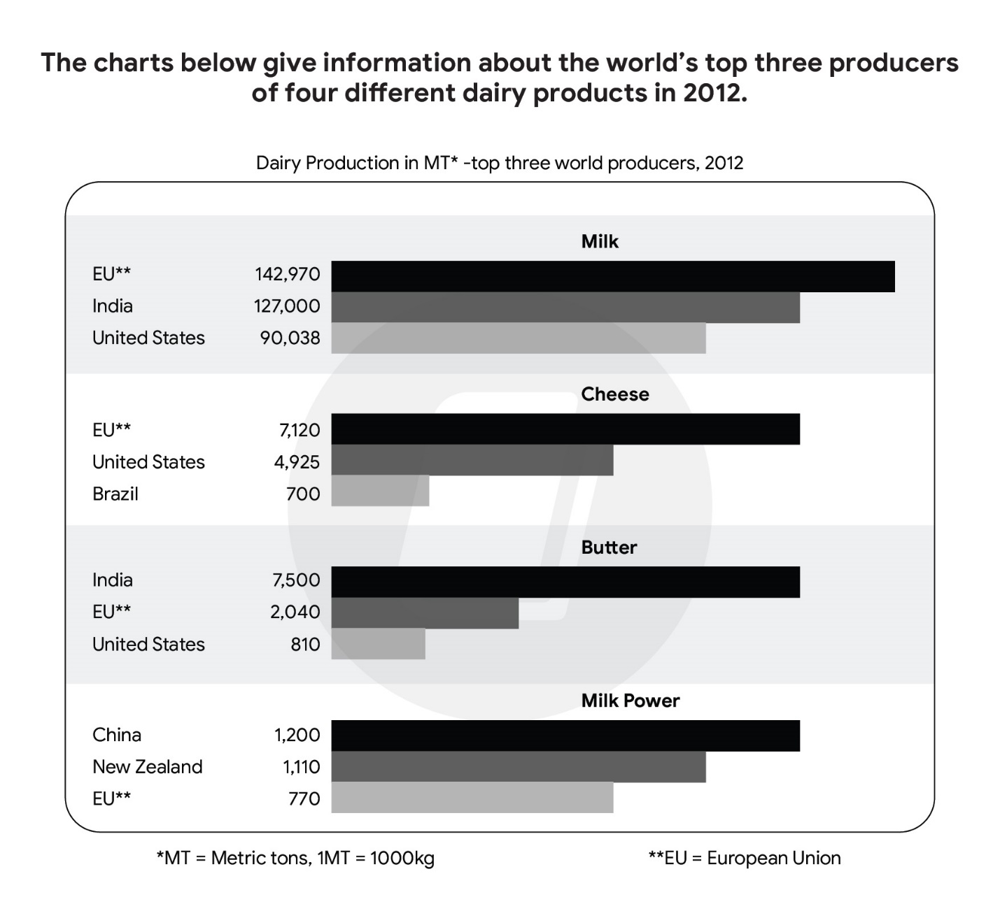
- **Mô tả bố cục biểu đồ**

Ex: The Japanese market accounts for 35% of the company's revenue.

- Clause 1, which + account for/make up/take up/consist of/comprise/ constitute + subject’s statistics + of + noun phrase

Ex: The proportion of regular smokers is the highest, which accounts for 35% of all types of smokers.

Lưu ý: Hai từ “comprise” và “constitute” không đi kèm với giới từ “of”

- **Cấu trúc nâng cao**
- Ý nghĩa: Cấu trúc câu này có ý nghĩa là sự phân bổ đối lập/tương tự có thể được thấy trong đối tượng khác
- Mục đích sử dụng: Cấu trúc này được sử dụng khi có 2 hoặc nhiều biểu đồ tròn có sự phân bổ khác nhau hoặc giống nhau giữa các đối tượng được so sánh.

“In San Diego County, residential water consumption accounts for 60% of total water usage. The use of water for industry and agriculture only takes up 23% and 17% respectively. An opposite allocation can be seen in the rest of the world.”

#### 1 Such + Adj + differences across categories + to-be verb + (not) seen in + N

- Ý nghĩa: Cấu trúc câu này dùng để miêu tả về tổng quát của sự khác nhau giữa các đối tượng của biểu đồ.

- Mục đích sử dụng: Cấu trúc này được sử dụng khi giữa các đối tượng của 1 biểu đồ có sự phân bổ khác biệt lớn hoặc phân bổ đồng đều so với các biểu đồ khác.

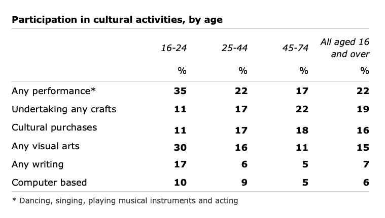

- “Such significant differences across categories are not seen in the water usage of California.”

Percentage – Proportion

- “proportion”: Tỉ lệ số lượng đã cho trên tổng số, có thể được dùng với cả phần trăm hoặc số lượng của một nhóm
- “percentage”: Tỉ lệ phần trăm
- ##### Cấu trúc 1:
- The + (adjective) + proportion/percentage of + noun phrase + verb + adjective.
- Ví dụ:
    - The proportion of men to women in the college has changed dramatically over the years. (Tỷ lệ nam giới so với nữ giới trong các trường đại học đã thay đổi đáng kể trong những năm qua.)
    - A high percentage of the female staff are part-time workers. (Một tỉ lệ cao nhân viên nữa là làm việc bán thời gian)
- ##### Cấu trúc 2:
- Subject + verb + a/the + (adjective) + proportion/percentage of + noun phrase
- Ví dụ:
    - Water covers a large proportion of the earth's surface. (Nước chiếm một tỷ lệ lớn trên bề mặt trái đất.)
    - There were no changes in the percentage of people aged 0-14. (Không có sự thay đổi gì về tỷ lệ phần trăm số người từ 0 đến 14 tuổi.)
- Lưu ý: Percentage có thể đứng một mình như một danh từ
- Ví dụ: In 2010, the percentages were 38 percent and 11 percent, respectively (Trong năm 2010, các tỷ lệ phần trăm lần lượt là 38% và 11%)
    - **WAY TO WRITE TABLE**
    - Đa phần giống như line chart
    - Be far more popular than: cái gì nhiều hơn/ áp đảo cái gì.
- In America, the car is far more popular than the motorbike. (Ở Mỹ, ô tô áp đảo xe máy).
- Far more X than Y: có nhiều X hơn Y.
- Far more men than women play tennis. (Có nhiều nam giới chơi quần vợt hơn phụ nữ)
    - A considerably higher number of X than Y: số lượng X nhiều hơn đáng kể Y
- A considerably higher number of male CEOs than female CEOs. (Số lượng CEO là nam nhiều hơn đáng kể CEO nữ).
- 14/11/2023:
- (28-10-2023) (diagram)
- The maps below give information about a plan to redevelop an industrial site.
- Summarise the information by selecting and reporting the main features, and make comparisons where relevant.
- 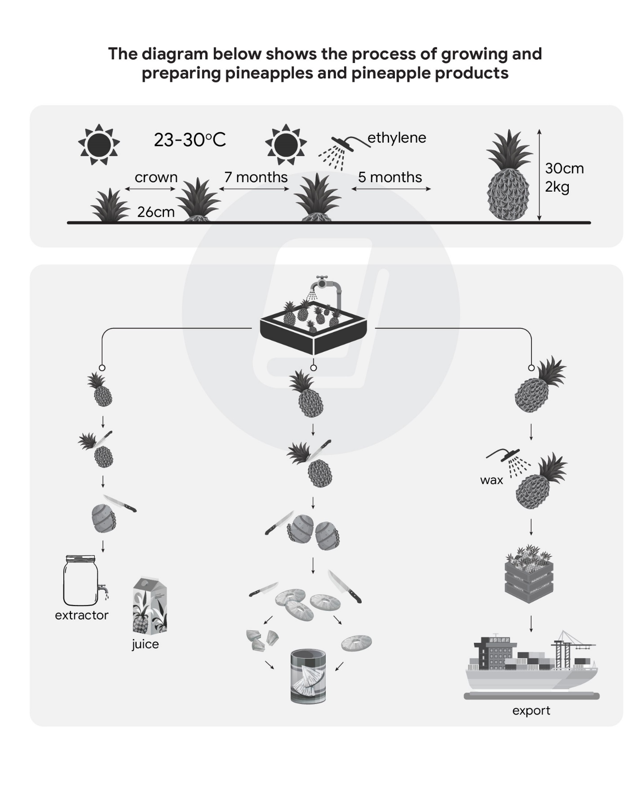
- The two plans show an industrial area as it is now and its redevelopment plan for the future.
- Overall, the site is expected to experience a significant alteration, with the most prominent being the development of accommodation, greenery, transportation amenities at the expense of workplaces. As a result, this will completely transform this industrial place into residential area.
- At present, the industrial complex is surrounded by ….. road, but workers can only access the place via entrance and reception located on Chimney road in the north. Once inside, they can park vehicles in the parking lot situated in the west of the site, just below which is a storage facility. In the south of the map, there are many office buildings consist of a canteen. Finally, there is a yard in the middile of the site.
- Following redevelopment, only the surrounding roads will remain unchanged. However, parking and storage spaces will be removed, making way for 3-bedroom 4-bedroom houses. The entrance and reception, yard will be replaced by three 2-bedroom houses and communal gardens, bordered by 3 private roads. Lastly, the office building and factory will be turned into parking garages and an apartments with their parking area, respectively.
- 15/11/2023:
- (21-10-2023) (diagram)
- The diagram below shows the process of growing and preparing pineapples and pineapple products.
- Summarise the information by selecting and reporting the main features, and make comparisons where relevant.
- 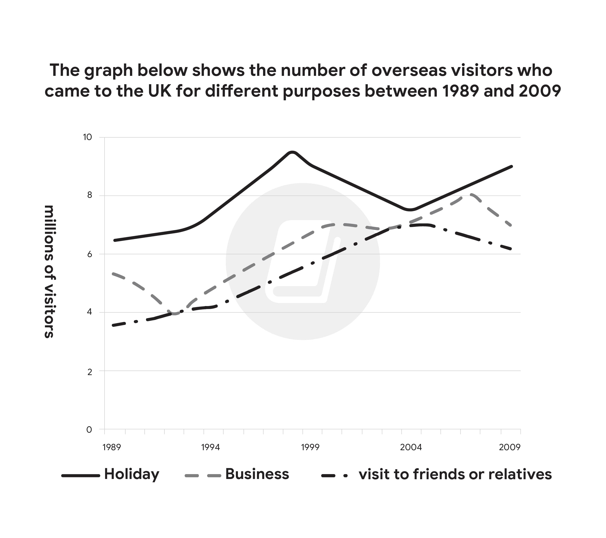
- The diagram shows the process by which the pineapples are grown and processed into different products.
- Overall, this process involves both natural and man-made elements and can be divided into 2 stages: The farming of pineapples and the processing of the crop, which turns into a beverage, a canned food or an export.
- First, pineapples are grown in the field which their crowns spaced 26 centimeters apart, and in climate where the temperature ranges from 23 to 30 degrees Celsius. After 7 months, ethylene is sprayed on pineapples, after which they continue to grow for an additional 5 months until they are ready for harvesting. At this stage, the pineapples should be 30 centimeters in height and 2 kilograms in weight.
- The process continues with the harvested pineapples are washed to being graded according to their sizes. After that, the smallest or the medium sized pineapples, have their top removed, which are put into the extractor to produce juice, the latter are cut into smaller slices or chunks, both of which are subsequently canned. In contrast, the largest pineapples are simply waxed and placed in crates before being ship aboard.
- 23/11/2023:
- (9-11-2023) (bar chart)
- The charts below give information about the world’s top three producers of four different dairy products in 2012.
- Summarise the information by selecting and reporting the main features, and make comparisons where relevant.
- 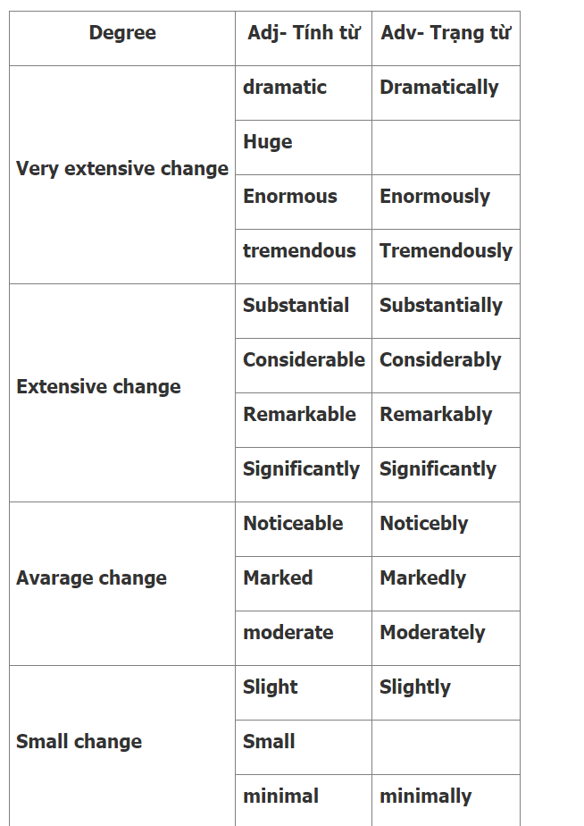
- The bar charts illustrate the product volume of four different dairy products by the world ‘s top three producing countries in 2012.
- Overall, the European Union was the leading producer of milk and cheese, whereas India and China were the biggest producers of butter and milk power respectively. Additionally, the total production of milk outstripped the other daily products listed, while the opposite was true in the case of milk powder.
- Regarding milk, the EU’s production reached an impressive level of 142,970 metric tons, exceeding India’s production by approximately 16,000 metric tons and that of the United States by over 50,000 metric tons. In cheese production, the EU’s total output in 2012 was 7,120 metric tons, significantly higher than the 4.925 metric tons produced by the US and the 700 metric tons by Brazil.
- Meanwhile, India was at the forefront of butter production, producing 7.500 metric tons, more than three times that of the US and the EU ‘s production figures. Despite the remaining top  3 world manufacturers in milk powder production, the EU fall behind China and India, producing 770 metric tons, compared to China ‘s 1.200 metric tons and New Zealand ‘s 1.110 metric tons.
- 27/11/2023:
- (4-11-2023) (Table)
- The table below shows the population ratio of females per 100 males in six different areas in 1995 and 2005.
- Summarise the information by selecting and reporting the main features, and make comparisons where relevant.
- 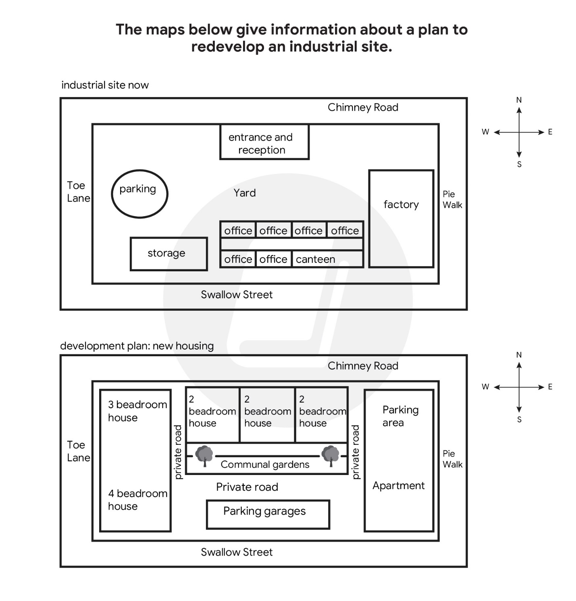
- The statistic illustrates the gender ratio, which the number of females for every 100 males, in six distinct regions for the years 1995 and 2005.
- Overall, there were increases in the ratios of females to males in Africa and Europe, whereas the opposite was true in the case of the remaining areas. Additionally, Asia and Europe remained the region with the highest and lowest proportions of females, respectively.
- North America ‘s ratio of females per 100 males dropped from 100.1 to 96.9 over the decade. A similar downtrend was observed in Oceania and Central America, where the ratio decreased from 103.9 to 99.8 and 100 to 97.5. Asia experienced the least significant changes in the ratio of females to males, from 105.3 to 104.9.
- Meanwhile, Europe ‘s female ratio started at 89.4 in 1995 and reached 92.8 in 2005. Africa also follows a similar pattern, growing from 97.8 to 99.2 during the same time frame.
- (14-09-2023) (Pie chart)
- The pie charts show the size of classes in primary schools in four states in Australia in 2010.
- Summarise the information by selecting and reporting the main features, and make comparisons where relevant.
- 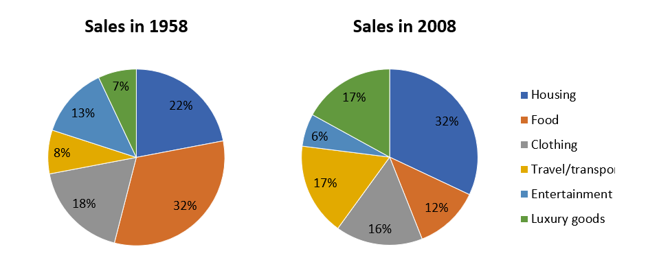
- The pie chart illustrates the primary school class ‘s space across four Australian regions in 2010.
- Overall, classes having 21-25 held the largest share in all four states surveyed, except South Australia, where the classses under 20 were the most common. In contrast, classes above 30 accounted for a minimum proportion in 4 states.
- Looking at New South Wales first, 37% of the primary level classes had 21-25 students, followed closely by those with 26-30 and fewer than 20 student (33% and 26% respectively). Regarding South Australia, the percentage of classes comprising under 31 ranged from 28% to 36%, with classes having maximum of 20 students being the most common. Notably, the figure for the biggest class size for 2 states is the same, each standing only 4%.
- In Australia Capital Territory, classes having 21-25 students constitute the majority, at just over half of all class sizes listed, compared to 38% of classes no having more than 20 students. This was in stark contrast to classes with 26-30 students, making up one-tenth of the total, ten times higher than the biggest size class. In Western Australia, the 21-25 students class occupied 42%, while a negligible difference was observed in the proportions of classes with under 20 and 26-30 students, with figures of 27% and 26%, respectively. In the last position was the largest class size, as it occupied 5%.
- 28/11/2023:
- (06-05-2023) (Line graph)
- The graph below shows the number of overseas visitors who came to the UK for different purposes between 1989 and 2009.
- 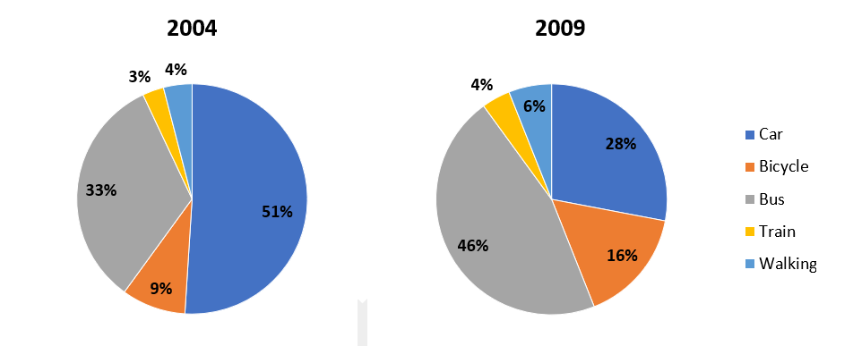
- The line graph illustrates how many foreign visitors came to the UK for distinct reasons from 1989 to 2009.
- Overall, there was an increase in the total number of overseas visitors visiting the UK, with the purpose of taking a holiday in this country being the most common, whereas the opposite was true in the case of meeting friends or relatives.
- Regarding those holidaying in the UK, the quantity consistently remained the highest, standing at just above 6 millions, after which it had risen sharply and reached the peak of nearly 10 millions in 1999. Despite dropping gradually to under 8 millions in 2004, this figure recovered to the end of period at approximately 9 millions.
- Meanwhile, the number of those having a business trip to the UK started just under 6 million in 1989 and reached a low of 4 million in 1994. Thereafter, this number soared and reached the highest point of 8 million in 2017, then it experienced a downtrend at the final year. Visting to friends or relatives had a similar pattern, which followed the uptrend from just under 4 million and hit a high of 7 million roughly in 2004, then declining to just over 6 million at the end of time frame.
- (Pie chart)
- The charts show the sources of electricity produced in 4 countries between 2003 and 2008.Summarise the information by selecting and reporting the main features, and make [comparisons](https:\zim.vn\cac-cau-truc-so-sanh-trong-tieng-anh-va-ung-dung-vao-ielts-writing) where relevant.
- 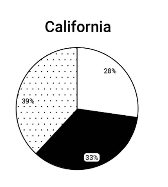
- The pie chart illustrates detailed information about the proportion of three different sources of electricity in four countries from 2003 to 2008.
- Overall, VietNam and Morocco did not use nuclear power to produce electricity. It can be seen that while fossil fuels were the largest source of electricity supply in VietNam and India, they only occupied a marginal proportion in Sweden and Morocco at the same time.
- In VietNam, 56% of the total amount of electricity was produced from hydro power, while the figure for Morocco made up just only one in twenty. The rest of the electricity, in both nations, was produced solely from hydro power.
- Regarding India, the electricity from fossil fuel constituted the majority, at just over four-fifths of all the powers listed, which was the highest figure for fossil fuel among the four countries. Meanwhile, fossil fuel only accounted for 4% of the total generated electricity in Sweden, the nuclear power contributed 52%, followed closely by 44% of nuclear power.
- *The charts show the main methods of transport of people travelling to one university in 2004 and 2009.*
- *Summarise the information be selecting and reporting the main features, and make comparisons where relevant.*
- 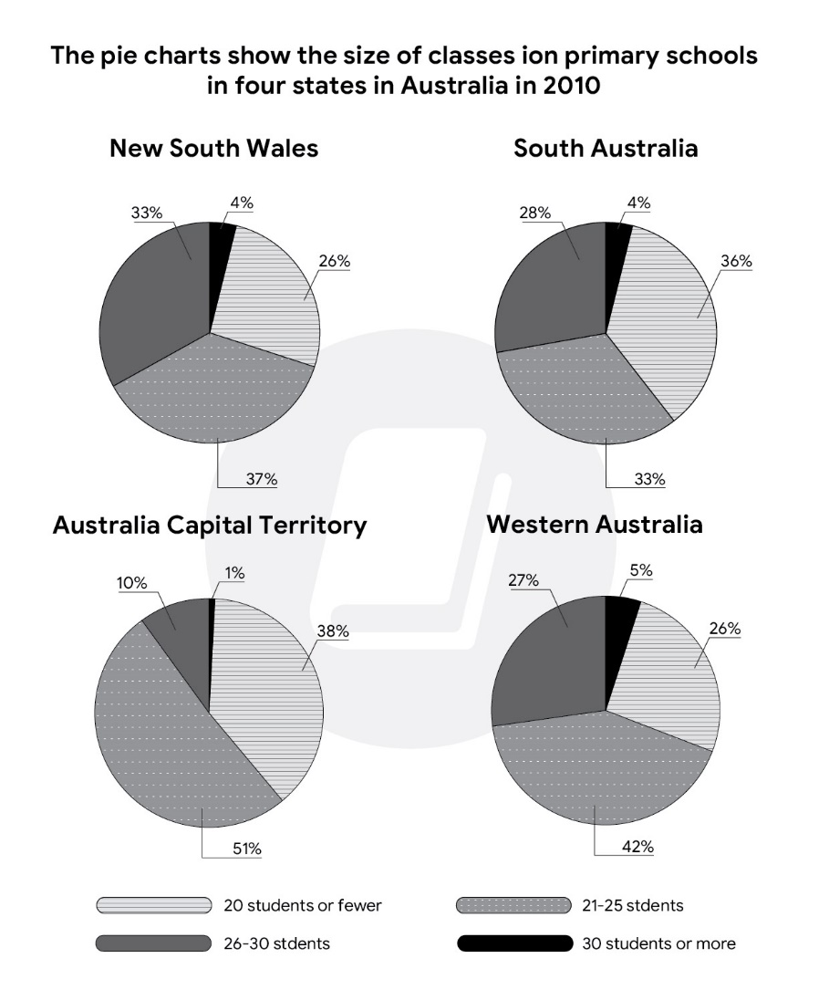
- The pie chart illustrates detailed information about 5 means of transportation for people travelling to one university during 2004 and 2009
- Overall, it is clear that travelling by train accounted for a minimum proportion, whereas there was a change, from cars to buses, for the most common form of transport over the five year period.
- Looking at the year 2004 first, just over half of students traveled to university by car, with only a third taking a bus. The remaining students rode by bike, went on foot, traveled by train occupied 9%, 4%,3 % respectively.
- Regarding the year 2009, the number of students traveling by car dropped to 28%, consequently the figure for bus increased to 46%,  which constituted the majority. All remaining methods went up, bicycle users rose to 16%,  and both train travelers and walkers increased by 1% and 2% respectively.
- *The charts below show the proportion of people’s total spending in a particular European country was spent on different commodities and services in 1958 and in 2008.*
- 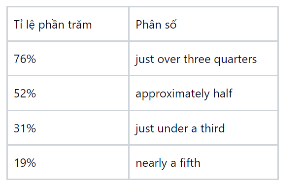
- The pie charts illustrate detailed information about how different commodities and services were spent by civilians in a European country in the years 1958 and 2008.
- Overall, it is clear that significant shifts occurred in spending across various categories, except clothing, with a substatial overall transformation over the 50 year period.
- Looking at the year 1958 first, people spent the largest proportion of their spending on food, at 32%, followed closely by 22% of housing. Entertainment, travel/transport, luxury goods occupied about 13%, 8%, 7% respectively.
- Analyzing the data from the year 2008, the number of individuals spending on food dropped to 12%, while the figure for housing increased to 32%, which constituted the majority. The expenditure of travel/transport and luxury goods witnessed a change, took up around 17% of total spending. The two other categories that accounted for the minority of this statistic are entertainment and clothing, just around 6% and 16% respectively.
- **The Table below shows the results of a survey that asked 6800 Scottish adults (aged 16 years and over) whether they had taken part in different cultural activities in the past 12 months.**
- Summarise the information by selecting and reporting the main features and make comparisons where relevant.
- 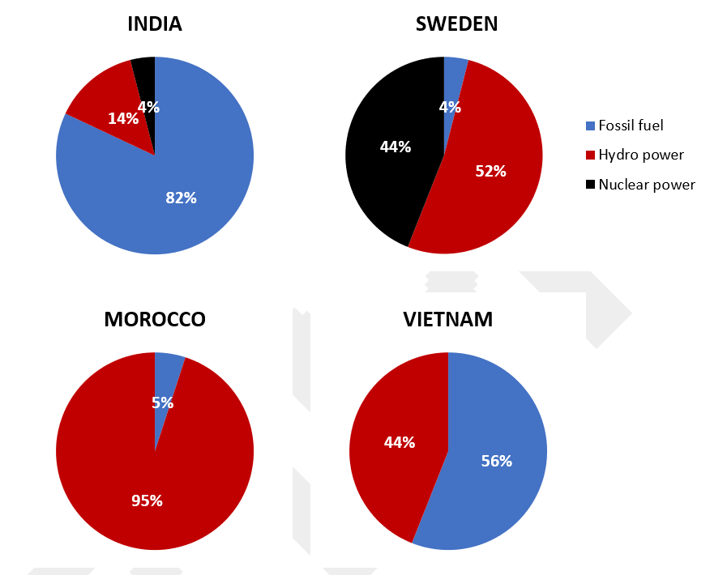
- The statistic illustrates detailed information about 6800 Scottish participants (aged from 16 to 74) who took part in distinct cultural activities over a 12 months period.
- Overall, this is clear that participation in any performance and undertaking any crafts were the most popular for all age group.
- The highest participation was seen in 16-24 age group, with 35% and 30% respectively doing any performance and any visual arts. In contrast, other activities were much lower, particularly those computer based, at 10%.
- Looking at 25-44 age group, the highest participation rate was seen at any performance, just 22%, was much lower compared to 16-24 age group. The figure for undertaking any crafts in group 45-74 years old witnessed a similar rate of 22%. Again, the computer based acitivity was the least common in above 25 years old group, an analogous pattern was seen at any writing field.
- Taking all groups together, any performance and undertaking any craft were  considered as the majority of participation, just over 19%. Followed closely by cultural purchases and any visual arts, at 15% 16% respectively. Finally, little interests was shown in any writing and computer based.